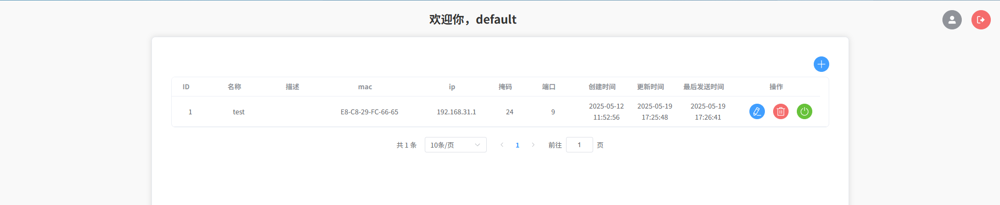

<div align="center" width="100%">
    
</div>

# Magic Packet UI

这是一个用于发送幻包（Wake-on-LAN Magic Packet）的 Web 界面程序，基于 [Vue 3](https://vuejs.org/) 和 [Vite](https://vitejs.dev/) 构建，需要配合后端 [magic-packet](https://github.com/yhxjs/magic-packet) 一起食用。

## 功能简介

- 通过 Web 界面输入目标设备的 MAC 地址，发送幻包，实现唤醒局域网内的设备。
- 简洁易用的前端界面，适合局域网环境下的网络唤醒需求。

## 项目启动

1. 安装依赖：

```bash
npm install
```

2. 启动开发服务器：

```bash
npm run dev
```

3. 打开浏览器访问 [http://localhost](http://localhost) 查看界面。

<picture>
  
</picture>

> 默认的账号：default 密码：123456
>
> 如果需要修改密码，需要在界面右上角的头像生成盐和密码。

## 构建生产版本

```bash
npm run build
```

## 相关链接

- [Wake-on-LAN 介绍（维基百科）](https://zh.wikipedia.org/wiki/Wake-on-LAN)

---

如有问题，欢迎提交 Issue。