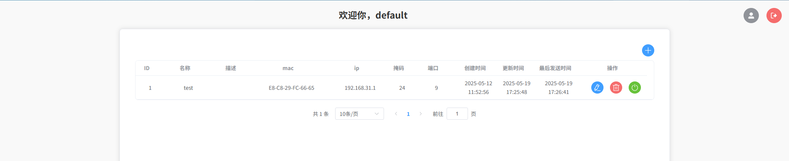

<div align="center" width="100%">
    
</div>

# Magic Packet UI

这是一个用于发送幻包（Wake-on-LAN Magic Packet）的 Web 界面程序，基于 [Vue 3](https://vuejs.org/) 和 [Vite](https://vitejs.dev/) 构建，需要配合后端 [magic-packet](https://github.com/yhxjs/magic-packet) 一起食用。

## 功能简介

- 幻包发送：通过 Web 界面向局域网内的设备发送幻包，实现网络唤醒。
- 配置管理：支持维护多个唤醒目标（名称、MAC 地址、IP、子网掩码、端口）。
- 修改密码：登录后可在界面右上角修改账号密码。

技术栈：Vue 3 + Vite + Element Plus + Pinia + axios。

## 环境要求

- Node.js
- 后端服务：需要先启动 [magic-packet](https://github.com/yhxjs/magic-packet) 后端（默认端口 `8081`）。

## 项目启动

1. 安装依赖：

```bash
npm install
```

2. 启动开发服务器：

```bash
npm run dev
```

3. 打开浏览器访问 [http://localhost](http://localhost) 查看界面（端口被占用时会自动顺延，实际地址以控制台输出为准）。

开发服务器会将所有 `/magic` 前缀的请求代理到后端 `http://localhost:8081`，可在 `vite.config.js` 中修改。

<picture>
  
</picture>

> 默认的账号：default 密码：123456

## 构建生产版本

```bash
npm run build
```

构建产物输出到 `dist/` 目录。将 `dist/` 下的文件复制到后端的 `src/main/resources/static` 目录并重新构建后端，即可直接访问 `http://localhost:8081` 使用，无需单独部署前端。

## 相关链接

- [Wake-on-LAN 介绍（维基百科）](https://zh.wikipedia.org/wiki/Wake-on-LAN)

---

如有问题，欢迎提交 Issue。
